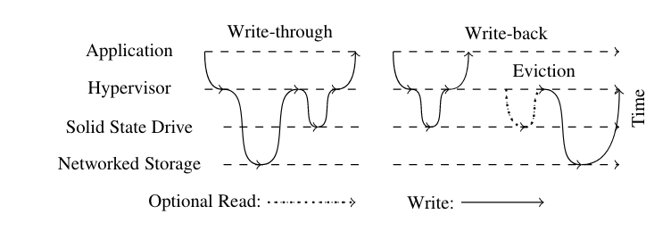
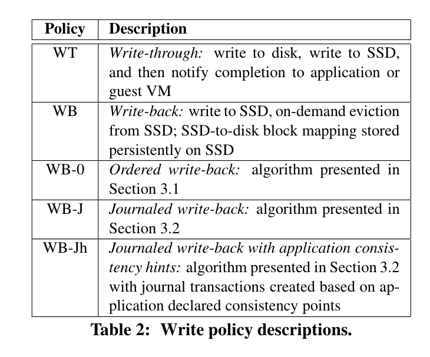
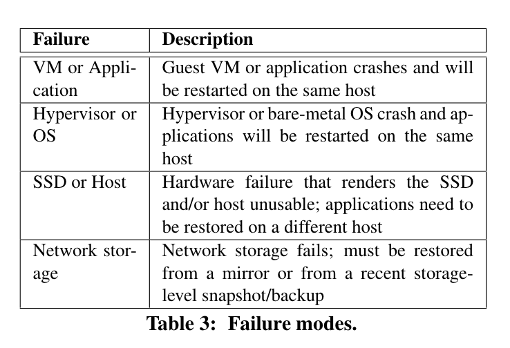

## 背景

主要是源自于ceph的`RBD Persistent Cache`持久化缓存,  针对这类缓存, 到底怎么才能保障业务的崩溃一致性呢?

这里主要讨论的还是设计定义的问题, 暂不涉及具体诸如WAL实现的问题.

# 定义

主要针对存储系统的一致性.

崩溃的定义, 是支持任意时刻的崩溃后, 产生一定的数据丢失后, 业务还能够正常访问, 或者彻底无法访问.

目前理解, 主要有几类区分业务的

* 针对文件系统的崩溃一致性
	* 如内核的page cache相关
	* 走fsync等接口的POSIX 语义支撑下的
* 针对数据库的崩溃一致性
* 针对应用的崩溃一致性 (App Crash Consistent Backup)

对应的不一致的典型问题
* space leak
* garbage data
* inconsistent data structures

初步理解是这样没错了.

### 文件系统测试工具

诸如
* [ALICE: Application\-Level Intelligent Crash Explorer](https://research.cs.wisc.edu/adsl/Software/alice/doc/adsl-doc.html) 
* [Application crash consistency and performance with CCFS \| the morning paper](https://blog.acolyer.org/2017/03/15/application-crash-consistency-and-performance-with-ccfs/) 的`BOB`,
* `jyy老师`的[C3: Crash Consistency Checker by jiangyy](http://jiangyy.github.io/c3/)
	* [jiangyy/c3: Crash Consistency Checker](https://github.com/jiangyy/c3)

## 解决方案[^1,5]

以下主要针对的是怎么保障文件系统写入过程中遭遇crash后, 依旧保障写入一致性的方式. 即写入块之后, 文件系统如何保障不会出现数据不一致.

### fsck
> 代表文件系统有最初的Berkeley FFS和Ext2，具有的优点是简单、高性能、易于修复和恢复数据，但是每次系统崩溃需要全盘fsck，无数据一致性保障，无正规的防御磁盘崩溃的措施。
### WAL
如 ext3, ext4,

> 典型代表文件系统有 Ext3、Reiserfs 以及其他多种文件系统。日志文件系统加入对近期提交到文件系统的事务的 log，log 顺序地写到磁盘上的一个保留的位置。文件系统的主体不会更改，直到事务完整地写到 log 中为止。日志使得文件系统可以快速从崩溃状态恢复，因为可以“回放”log，完成任意未半完成状态（文件系统的更改信息已经写到了 log 中，但是还没有写到文件系统中）的操作。日志文件系统存在的问题包括两次写问题（每个操作必须写磁盘两次，一次是写到 log 中，另一次是写到文件系统中最终的位置）以及受限的日志空间带来的多种性能问题。此外，日志文件系统也没有改善磁盘崩溃的情况。

#### Log Structured 

> 典型代表文件系统LFS。Log-structured文件系统在文件系统研究社区反响强烈，但是从未用于主流商业产品用途。Log-structured的主要设计思想是：首先，以log的方式将更新写出，这将一组随机写IO转换成一个大的连续的写入流，写操作更为高效；其次，整个文件就是一个巨大的连续事务log，对文件的更新直接追加到log中（解决了Journaling文件系统的两次写问题），数据的更新不会在本地覆盖写——从这个意义上看log-structured文件系统也是一种Copy-on-write(COW)文件系统。Log-structured文件系统的主要问题是系统需要大的空闲的segments磁盘空间，这些空闲的segments由“cleaner”线程创建。非完全空闲的segments中的已分配的blocks必须移出到其他的segments中。尽管对cleaner的优化进行了多年的研究，cleaner线程的开销仍然非常高。此外，计算空闲空间的总数也很困难，因为COW文件系统直到数据块的新的拷贝写入成功的时候才会释放该数据块的旧的拷贝块，而一次操作需要完成的数据块拷贝的数量是不可预测的。最后，强制重分配数据块需要在每次写操作的时候做一个“good”的分配决策，而本地更新文件系统仅需要做一次的“good”分配决策。

### Other Approch

#### Soft Updates

-   基本原理是将所有文件的更新操作请求进行严格排序，并且保证磁盘对应的数据结构不会处于不一致的状态，比如先写文件数据内容，再写文件元信息，以保证inode不会关联一个
- 无效的数据块。

> Soft updates 是对 Berkeley FFS 的优化，在文件系统崩溃的时候，保留磁盘上的文件系统格式数据（也就是元数据），使得无需执行 fsck 程序就可挂载文件系统。Soft updates 仔细调整对文件系统的更新顺序，因而任意时刻文件系统发生崩溃，除去部分“leaked”（标记为已分配，实际上是空闲的）的 inodes 和 blocks 外，文件系统数据是一致的。后台 fsck 程序运行在文件系统的快照上，找出这些未引用的 blocks 并将其再次标记为空闲。Soft update 是的负面影响主要是极度复杂，难于理解和实现，并且每个文件系统操作需要其自己独特设计的 update 代码。当前已知的仅有一个实现的 soft updates 实例。

#### CoW
> 最新趋势的文件系统架构。COW 文件系统的典型代表是 WAFL (Write Anywhere File Layout, Network Appliance 的内部文件系统)、ZFS 以及 Btrfs。这些文件系统以树的方式组织文件 blocks。当一个 block 更新的时候，就分配一个新的 block，链接 block 的指针指向更新后的 block——当然也会引起这些指针所在的 block 的更新产生。当一组一致的更新写到磁盘之后，root block 自动更新为指向新的 blocks 树，该新的 blocks 树包含最新的分配信息。这种结构方式极其易于实现文件系统快照技术，而且集中了文件系统一致性代码。COW 文件系统的不足之处与 Log-structured 文件系统相似——每次写操作要强制重分配，同时不确定完成一次更新需要多少的磁盘空间。同时，好的同步性能需要加入某种 journal，使得 COW 文件系统的实现更复杂。

#### backpointer-based consistency

FAST12 - Consistency Without Ordering
在写操作之间不强制排序，为了达到一致性，一个额外的反向指针被添加到系统中的每个块中，即每个数据块都有一个对它所属的inode的引用。
当访问一个文件时，文件系统可以通过检查正向指针(例如inode中的地址或直接块)是否指向指向它的块来确定该文件是否一致
通过向文件系统添加反向指针，可以获得一种新的延迟崩溃一致性

ZFS, LFS

#### optimistic crash consistency

-   [SOSP13 - Optimistic crash consistency](https://dl.acm.org/doi/10.1145/2517349.2522726)
-   这种新方法通过使用事务校验和的一般化形式，向磁盘发出尽可能多的写操作，还包括一些其他技术，可以在出现不一致时检测。对于某些工作负载，这些乐观技术可以将性能提高一个数量级。但是，要想真正正常工作，需要一个稍微不同的磁盘接口
-   主要用于优化磁盘写入日志记录的过程，以减少等待数据刷盘所导致的时间开销。

# FAQ

### 功能中所说的crash consistent, 能否保障上面的数据库或者文件系统不损坏? 只是丢了一段时间的数据呢?

数据库感觉有可行性, 那文件系统呢?

包括快照技术所谓的静默同理.

fsfreeze这个倒是感觉有可行性, 毕竟是能感知到文件系统内的行为的.

除非文件系统的损坏, 主要指代的就是上层的写入只写了一半那种, 而但凡能够保障写入的一致性, 文件系统就不会损坏. 那样的话, 倒是可以理解为没有问题.

一半这部分行为， 一半是包括上层的flush+下层的freeze, 确保不存在依旧保存在内存中的对象

那如果是走rbd的行动, 当没有文件系统, 其实是走rbd cache. 此时技术上应该是可控的?

而如果是纯操作系统层面, 那就不归存储端管控了. 所以如果是在这个盘上建的文件系统的方式, 那可能依旧无法管控到位.

通常在对数据进行备份时，存在以下三种数据保护的一致性：

1. 不一致备份（In-consistent backup），表示备份的数据是正在改变的数据；
2. 崩溃一致备份（Crash-consistent backup），表示备份的数据类似系统异常宕机时的状态；
3. 应用一致备份（Application-consistent backup），表示备份的数据是应用可用的数据；

按照社区这段当时的意思, 我觉得我可以理解了, 基本上就是通过这个写缓存, 确保即便盘丢了, 文件系统也不坏, 只是丢失一段时间写入的数据. 相当有回滚能力.

只是怎么实现的暂时还没太理解, 单纯的日志结构, 可以满足数据, 但是文件系统不损坏的flush等请求, 如何保障?如果这个rbd挂载后, 上层建了文件系统, 那样的话, 如果文件系统不下写io, 那是做不到的.

除非我对POSIX语义理解还是有问题

但是下面那几个, 主要指代的都是backup技术了, mirror这种方式, 因为始终有一端是存活的, 自然数据依旧能够保存下来保证一致性了. 

我比较关心的是在不引入额外开销backup的情况下, 如何维持应用的崩溃一致性, 即可以接受与上层交互的情况下, 如何让下层在写入时, 能够产生与上层的联动?

剩下的是持久化缓存, 在ssd->持久化集群之间, 如何保障ssd上数据丢失后, 持久化集群中的历史数据依旧能够提供旧版本的服务? 单纯从上层文件系统场景角度, 它需要能做到针对每次fsync等行为, 不做其他的合并, 仅下刷每几次fsync之类中间的数据, 可能能够达到满足的效果.

按照每次写都触发sync, 和flush时sync, 前者可以保障. 后者是否会产生局部写入情况? 毕竟rados接口本身不识别有些内容.

> -   An **ordered** **write-back** cache that maintains checkpoints internally (or is structured as a data journal), such that writes that get flushed back to the cluster are always **crash consistent**. Even if one were to lose the client cache entirely, the disk image is still holding a valid file system that looks like it is just a little bit stale [1]. Should have durability characteristics similar to async replication if done right.
[Rbd \- ordered crash\-consistent write\-back caching extension \- Ceph \- Ceph](https://tracker.ceph.com/projects/ceph/wiki/Rbd_-_ordered_crash-consistent_write-back_caching_extension)

根据这里的这段描述可知, 这个崩溃一致性的假设中初步是基于文件系统的, 其效果可能确实就是源自于对sync等行为的有序flush?

> The alternative proposed here is a "journaled" WB policy as described in [2] which ensures that blocks get evicted from flash cache (and synced to the networked storage) in the original write order, the networked storage state atomically transitions from one consistency point to the next (for crash-consistency) and allows for optimizations (e.g. write coalescing in the cache).

设计来源是`Write Policies for Host-side Flash Caches - [http://users.cis.fiu.edu/~raju/WWW/publications/fast2013/paper.pdf](http://users.cis.fiu.edu/~raju/WWW/publications/fast2013/paper.pdf)` , 这篇论文看着是提供了`我们开发并评估了两种一致的回写式缓存策略，有序的和日志式的，它们的设计比直写式的性能越来越好`

> Under host and/or host-flash failures, these policies do result in data staleness (i.e., loss of recent updates) at the network storage. They thus apply only to applications which can tolerate a non-zero RPO. Journaled write-back additionally allows for a straightforward implementation of application-level storage consistency,astricterformof consistency than the transactional consistency provided by write-through

主要我存疑的是, 单纯的同步写, 保序之后, 是否上层的业务一定不会死? 丢失内存中的数据, 是否就之前的写入依旧是可用的?
按照上面文件系统的那种表达, 只要落盘了的, 那就确实有效

但是如果是没有完成刷盘, 局部落盘的情况下, 能否有效, 就可能确实得看上层的写入方式了.

如果这个ssd的写入也存在局部落盘情况, 那这个一致性,不就又得靠上层的文件系统自身的WAL/fsck等机制来自行修复保障? 

如果走到这个情况, 那可能就不满足崩溃一致性了吧?

按照这段的意思, 就是journaled writeback完成的这个功能实现. 但是单纯不感知业务的话, 做不到才对呀.

所以是在librbd层实现了对应的journal的,而不是现有的直接读写rados对象那种形式了.

至少有一层journal, 那确实可以保障上层业务能够访问到的确实一定是完整的flush过的. 而不会是局部的

TODO: 具体源码实现待后续了.

### 一致性分析, 故障模式

论文中都有提到.

* 时间点一致性(PiT C)
* 事务一致性(Tx C)
* 应用一致性/应用组一致性(App C)

#### POSIX语义如何保障文件系统一定不损坏.

所以是POSIX语义来完成的这个保障吧? 当用户遵循了POSIX语义使用了fsync等接口时, 此时这个文件系统内的可靠性就得到了保障?

而如果没有使用时, 则自然就无从保障?

是否主要牵扯的是当文件系统修改元数据时, 这部分元数据一旦没能被持久化下来带来的损坏呢? 

是否可以理解为保序就可以?

但是必须得是文件系统或者数据库自身实现的

所以如果我有一个单独的缓存盘, 这个缓存盘自身是无法实现这个效果的. 

| Operation     | Crash-consistent | Application-consistent |
|---------------|------------------|------------------------|
| 备份文件的时间点是否一致  | ✔                | ✔                      |
| 利用快照进行卷级或文件备份 | ✔                | ✔                      |
| 快照时数据库或应用提前静默 | ×                | ✔                      |
| 恢复时数据是否一定正常使用 | ×                | ✔                      |

**但是这种状态有多一致呢？**

从vss参与的组件可以知道，只有文件系统本身参与了，一些应用比如SQLServer等并没有参与，所以说假设我们把快照中的数据都备份了，然后再把备份的数据都还原，SQLServer大概率是可以正常启动的，但在运气不好的时候可能是无法启动的。

我们称这种一致状态为crash-consistent状态。

Crash-consistent对于保证被保护数据尽量在同一个时间点上，已经是一种很大的进步了，但是对于最稳妥的数据保护来说这还不够，还需要支持更高级别的一致性，即应用级别的一致性，这就是application-consistent。

根据上面这段的表述, 说明这个技术确实是做不到的.

性，方式一是通过数据库或应用提供的接口或工具进行备份，方式二是调用数据库静默后进行快照，再备份快照文件。应用一致性的保证，一般都需要应用本身参与，例如备份接口或静默指令。再拿windows举例，vss可以实现上述方式二的应用一致性备份，且很简单，可以通知系统中的那些支持vss writer机制的应用比如sql，exchange等去flush数据并处于类似静默状态，使应用本身在快照时保持自己的一致状态，这样就确保了备份下来的数据一定是能够被应用正常使用的。

所以配合上述的方案, 提供对应的接口才能做到. 文件系统同理. 单纯的下层是无法满足的

所以这个情况下rbd的那个quinsce接口倒是具有对应的价值了吧.

CDM（Copy Data Management副本数据管理）是具备原生的、天然的application consistent属性。Gartner给出CDM的定义是：它从生产环境通过快照技术获取有应用一致性保证的数据，在非生产存储上生成“黄金副本”（Golden Image），这个“黄金副本”数据格式是原始的磁盘格式，可再虚拟化成多个副本直接挂载给服务器，分别用于备份恢复、容灾或开发测试。

#### 文件系统的sync , 怎么落到块上, 让块有所感知呢?

# Todo

> 说，我们希望在程序执行结束后，把线程本地的读/写操作日志合并成全局的变量读/写序列，相当于给所有读/写事件分配发生的先后次序，使得每个读事件读出的数值都等于最近一次对该变量写入事件写入的数值（即根据线程本地日志得到全局满足顺序一致性的事件排序），如图 1 所示。Gibbons 和 Korach 在1997年对于“哲学家吃中餐问题”给出了一个颇为悲观的答案[1]：如果 P ≠ NP，再聪明的哲学家也无法在多项式时间里恢复出满足顺序一致性的事件排序。甚至，即便哲学家吃的是火锅(只有一道菜，即一个变量的情形)，NP-完全性也是成立的。

> 则是应用程序自己对数据一致性的处理，我们都知道，每次文件操作之后，都进行强制 sync，这样就是非常安全的（当然，这里排除了硬件故障），但大家知道这个性能就是非常的差了，所以为了性能，我们势必在文件操作上面做很多优化，这些就在崩溃的时候引入了不确定性了。

  
  
作者：siddontang  
链接：https://www.jianshu.com/p/4bd91c097c35  
来源：简书  
著作权归作者所有。商业转载请联系作者获得授权，非商业转载请注明出处。

一般通过上面提到的文件系统的解决方案就可以规避. 这部分提供澄清的接口遭遇异常时的响应, 从而让用户自己可以知晓在何种情况下会存在快照创建出来, 但是实际数据却无法保障一致性.

# Reference
1. <Operating Systems: Three Easy Pieces>
2. [存储系统中的一致性 \| YouDieInADream](https://blog.shunzi.tech/post/dist-block-consistency/)
3. [文件系统天生就是不平等的 \- 实现崩溃一致性应用的复杂性 \- 简书](https://www.jianshu.com/p/4bd91c097c35)
4. [Crash\-Consistent vs\. App\-Consistent Backups Comparison](https://www.nakivo.com/blog/crash-consistent-vs-application-consistent-backup/)
5. [主流Linux/Unix文件系统架构简介\-登高望远海\-ChinaUnix博客](http://blog.chinaunix.net/uid-28989651-id-3833383.html)
