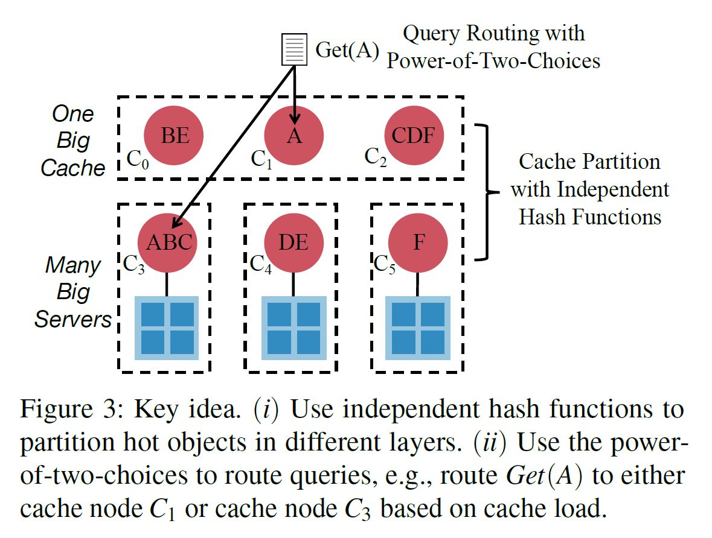

# DistCache: Provable Load Balancing for LargeScale Storage Systems with Distributed Caching[^1]

## Small Cache解决的Ball into bins 问题
> Balls into bins 问题讲的是如果有 M 个小球随机等概率地扔进 N 个垃圾桶, 那么装球最多的那个垃圾桶大概率会有多少个球?

$$O(\frac{logn}{loglogn})$$

结果并不是正态分布的.

> 上面那个公式计算的是 max load. 假设有 64 个 node, LB 随机分配流量, 那么 load 最大的 node, 负载将会是平均负载的 log 32 / log log 32 = 2.7 倍. 

> 解决方案出奇的简单(起码理论上是这样的), 这就引出了 The Power of Two Random Choices. LB 在分流的时候, 随机比较两台(d = 2)后端服务器的 load, 选最小, 得到新 bound.

> $$ O(loglogn/logd) $$
> `log d`是常数, 可忽略.
> $$ O(loglogn) $$
> log log 32 = 1.2, 所以只需要预留20%.

> 2 choices 可以解决无状态的 load balance 问题, 但这对存储不起作用. 因为 LB 没有办法按 load 分流, 比如 key A 存在服务器 S 上, S 跑满了, LB 就能把 query redirect 到别的机器上吗?

> Small Cache, Big Effect 这篇 paper 很大程度上解决了这个问题. LB 与 cache layer 存在很强的互补关系. LB 讨厌 imbalance, 但 cache 喜欢. query 越 skew, cache 效率越高.

> 在一个多 node 的存储系统, cache 至少要多少才有足够的信心说这个系统没有热点呢? paper 给出的答案吓死人了! 居然只要 $O(nlogn)$ !n 是 node 数量.

## DistCache
> Introduction：存储系统的工作负载高度倾斜，过载节点成为系统性能瓶颈，SoCC11[1]一篇文章证明了，n个存储节点，无论query是怎样的分布，缓存最热的O(nlogn)个对象即可均衡负载。SwitchKV和NetCache都使用该机制均衡KV存储集群的负载。单个缓存可以完成集群内的负载均衡（比如一个机柜），但集群规模不断扩展，集群间会出现负载不均的问题，也即过载集群的工作负载远高于其他集群，超过了该集群cache提供的缓存能力，该集群成为大规模集群的性能瓶颈。将一个集群视为One Big Server，m个集群视为m个Server，按照一个cache的机制进行扩展，采用更大的cache提供缓存功能，不具有可扩展性，即伴随着系统工作负载增加，heavy hitter需要的吞吐量势必超过One Big Cache的吞吐能力。

> One Big Cache性能不足，扩展机制从One-Cache到Multi-Cache扩展，形成一层Cache Layer。现在就有两层cache，第一层cache layer，每个cache在所属集群中均衡负载，第二层cache均衡集群间的负载。怎么缓存heavy hitter和怎么在两层cache间query item成为了新的问题。如果采用replication机制，将第一层中最热的item复制到第二层的每个cache中，可以提供很强的读性能，但是在写的情况下，会带来很大的缓存一致性开销。如果采用partition机制，过载的cache热点无法打散，依旧是性能瓶颈。如何在partition和replication之间做trade off，平衡读写性能，是本文的关键。

> 缓存热点时使用independent hash function，如图3，ABC三个热点hash到同一个cache中，在第二层hash时采用不同的hash函数，旨在将热点打散，如图中，ABC分别被打散到第二层的cache中了。查询时采用power-of-two-choices，如图3，query A时观察C1和C3的工作负载，查询工作负载小的cache节点。

> 作者给出的方案很简单, 就是双层 cache. 当前所有 cache server 的所有 KV 用一个新的 hash function 存在另一层 cache layer 里. 从数学和直觉上可以确保, 任意一层的 cache server 出现了热点, 那么这个热点的 KV 数据在另一个 cache layer 是分散的, 无热点的.
> 
> 然后在哪一层 cache 找 key 的问题又可以转化为 The Power of Two Random Choices 问题, 选负载最低的.

### 系统
> 系统搭建承接了SOSP17的NetCache[2]工作，要具体理解本文的系统，还需追溯到NetCache去

这篇`NetCache`里提到的主要架构应该是利用交换机和路由器来进行缓存读请求, 通过实现一套协议, 让存储服务器和交换机之间完成这个缓存数据的交互(读:查询, 写:write-through).

# Reference
1. [FAST 2019 DistCache · 阿吉的博客](https://jimchenglin.github.io/2019/04/15/FAST-2019-DistCache/)
2. [\[Paper Review\]FAST'19 DistCache \- 知乎](https://zhuanlan.zhihu.com/p/59109563)
3. X. Jin, X. Li, H. Zhang, R. Soulé, J. Lee, N. Foster, C. Kim, and I. Stoica, “NetCache: Balancing key-value stores with fast in-network caching,” in ACM SOSP, October 2017.
4. [NetCache \-\- Balancing Key\-Value Stores with Fast In\-Network Caching · Columba M71's Blog](https://nan01ab.github.io/2018/05/NetCache.html)