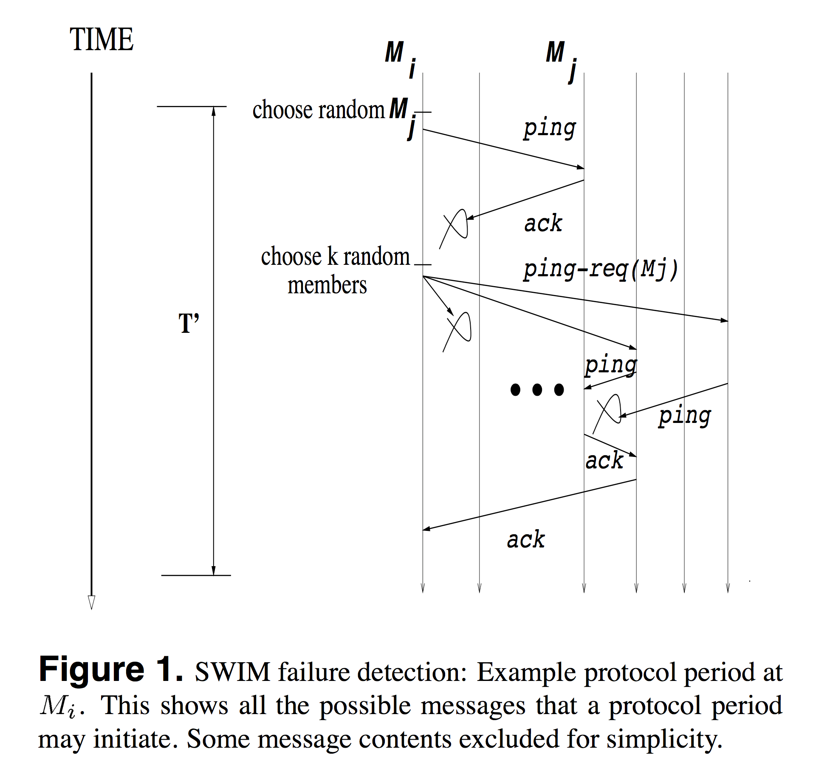
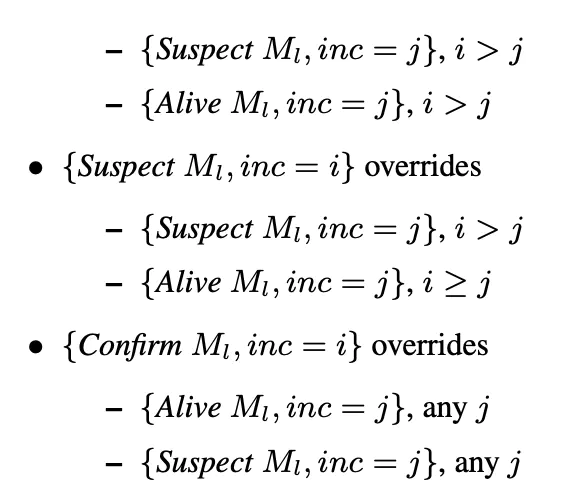

# 论文 <Scalable Weakly-consistent Infection-style process group Membership protocol>

> 
> 可扩展弱一致性感染型进程组成员协议
> 
> 进程组的成员关系协议
> 
> * 可伸缩性
> * 弱一致性
> * 感染性
> 
> 用于分布式系统中进程的健康检测或者说错误检测
> 
> SWIM是通过Gossip实现的Membership保持协议，也就是维护分布式系统节点的状态

# 成员资格协议

> 成员资格协议的可伸缩型和执行效率主要由以下几个方面确定：
> 
> 完备性：是不是每个失效的进程最终都能够检测到？
> 
> 失效节点的检测速度：一个节点失效到它被非失效节点检测到的平均时间间隔是多长？
> 
> 准确性：实际上进程未失效但却被认为是失效的频度（即误判率）是多少？
> 
> 信息量：每个节点生成的网络通信的信息量有多大，它是否也是分布式的？
> 
> 理想情况下，我们需要这样的协议：它一定要完全100%准确，这就意味着可以检测到每一个失效进程，而且不存在任何误判。然而，像分布式系统里的其他协议一样，存在这样的事实：在异步网络上保证100%的完备和准确是不可能的。因此许多成员资格协议（包括SWIM)为了完备性就会降低准确性，同时尽最大可能降低误判率。
> 

# 模块
## Failure Detector, 用于Node失败检测
> 
> 概念：
> 
> T’: 协议周期，2次探测的时间间隔
> k: k个节点
> 该协议中，若Mi检测Mj状态，则先发一个ping包到Mj，若Mj未在超时时间内ack，则Mi随机选择k个节点，发送间接探测ping-req包，k个节点如Mh收到ping-req请求，将会ping Mj并将结果返回给Mi。若任意一个ping-req返回Mj存活，则Mj存活。
> 
> 上述过程，包含3个round-trip的网络过程，Mi->Mj, Mi->Mh, Mh->Mj，所以T’ 要大于3个超时；如T’=1s, timeout=200ms

这里故障监测, 也存在一篇论文讲到`[SRDS 2004] The Phi Accrual Failure Detector`讲到可以通过概率模型来判断都次未响应后到底该节点是否已经离线, 还是只是网络波动缘由导致. 这个还挺可靠的, 的确某个设备的链路存在波动问题时, 常常代表他的响应会是长期离线的.

> 1. 假设 heartbeat message 符合某一概率模型。例如定期发送的 heartbeat message 在有网络延迟的情况下，接收到消息的 interval 符合正态分布。
> 2. 利用接收到的历史数据（滑动窗口），对概率模型参数进行极大似然估计。
> 3. 利用估计得出的参数带入模型，计算在当前时刻接收到 heartbeat message 的概率
> 区别于传统方法，此时不直接得出对端是否存活的判断，而是直接向上层应用返回这一概率，由上层应用自行进行解释，是这篇论文中提出的另一个“亮点"。

## Dissemination 模块，用于将Node主动加入、退出或失败的信息传播出去

> 当Mi检测到Mj失败，会利用IP多播等方式，发送一条 failed(Mj) 的消息，收到消息的Node，会把Mj从本地Node表中踢除。

# 思考

所以理论上, 基于这个的linux集群网络稳定性监控机制应该是有的吧.

# Reference
1. [Scalable Weakly \| 大专栏](https://www.dazhuanlan.com/2019/11/04/5dbf34e0e3a3a/)
2. [致远的 BLOG](http://understars.ltd/archives/swim.md
3. [分布式系统中的 SWIM 成员协议 \- OSCHINA \- 中文开源技术交流社区](https://www.oschina.net/translate/swim?cmp))
4. [论文笔记：\[SRDS 2004\] The Phi Accrual Failure Detector \- 知乎](https://zhuanlan.zhihu.com/p/33819239)