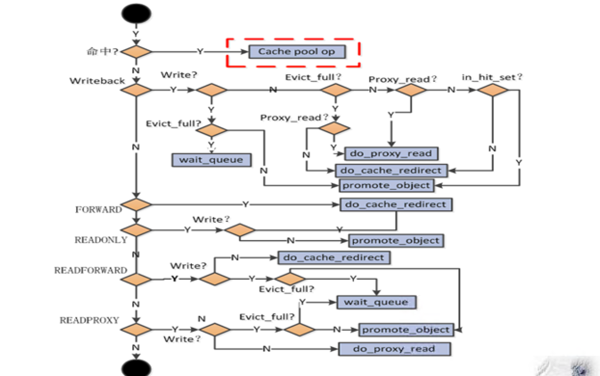

## 数据整理
### 写入效果统计

$$
\frac{num\_write_{cache}}{num\_write_{cache} + num\_write_{base}}
$$

### 读取效果统计

$$
\frac{num\_read_{cache}}{num\_read_{cache} + num\_read_{base}}
$$


### 数据收集
#### osd daemon tier perf
实际还是pg的数据, 只是没有在pg那里直接对外暴露

``` json
{
    "cache": {
        "tier_whiteout": 0,
        "tier_try_flush_fail": 0,
        "tier_proxy_read": 0,
        "tier_dirty": 2,
        "tier_promote": 3,
        "tier_clean": 0,
        "tier_delay": 0,
        "tier_flush_fail": 0,
        "tier_flush": 0,
        "tier_try_flush": 0,
        "tier_evict": 0,
        "tier_proxy_write": 3
    },
    "base": {
        "tier_whiteout": 0,
        "tier_try_flush_fail": 0,
        "tier_proxy_read": 0,
        "tier_dirty": 3,
        "tier_promote": 0,
        "tier_clean": 0,
        "tier_delay": 0,
        "tier_flush_fail": 0,
        "tier_flush": 0,
        "tier_try_flush": 0,
        "tier_evict": 0,
        "tier_proxy_write": 3
    }
}
```


#### pg perf
``` json
{
    "cache": {
        "num_write_kb": 3,
        "num_evict_mode_full": 0,
        "num_write": 8,
        "num_bytes_hit_set_archive": 83,
        "num_promote": 3,
        "num_whiteouts": -1,
        "num_bytes": 6991,
        "num_read_kb": 53,
        "num_flush_kb": 0,
        "num_evict": 0,
        "num_flush": 0,
        "num_evict_kb": 0,
        "num_read": 61,
        "num_objects_hit_set_archive": 1,
        "num_flush_mode_high": 0,
        "num_flush_mode_low": 0,
        "num_objects_dirty": 2
    },
    "base": {
        "num_write_kb": 8,
        "num_evict_mode_full": 0,
        "num_write": 3,
        "num_bytes_hit_set_archive": 0,
        "num_promote": 0,
        "num_whiteouts": 0,
        "num_bytes": 6890,
        "num_read_kb": 1,
        "num_flush_kb": 0,
        "num_evict": 0,
        "num_flush": 0,
        "num_evict_kb": 0,
        "num_read": 5,
        "num_objects_hit_set_archive": 0,
        "num_flush_mode_high": 0,
        "num_flush_mode_low": 0,
        "num_objects_dirty": 3
    }
}
```
### 统计指标所在场景



根据上面这张图以及`<ceph源码分析>`可知, 主要的最后执行任务场景如下

#### read
* cache pool read op -> 
  * num_read(cache)+
* do_proxy_read  -> 
  * tier_proxy_read(cache) + 
  * num_read(base)+
  * num_read(cache)+
* do_cache_redirect -> 
  * num_read(base) +
* promote_object -> 
  * num_promote(cache) +
  * num_read(base)+
  * num_read(cache)+

#### write
* wait_queue(block) -> 重新进入下面3个逻辑
* promote_object -> 
  * num_promote+
  * num_write(base)+
  * num_write(cache)+
  * num_read(base)+
  * num_write(cache)+
* do_cache_redirect
  * num_write(base)+
  * num_read(base)+
  * num_read(write)+
* do_proxy_write
  * tier_proxy_write(cache)+
  * num_write(base)+
  * num_write(cache)+
  * num_read(base)+
  * num_read(cache)+

#### 汇总
可知, `promote`和`proxy`并不是强相关的,只有实际的`op`的`read`和`write`存在强相关性.

只是由于[read类型](#num_read计数op类型)和[write类型](#num_write计数op类型),可知元数据的读写也被统计了. 不过在总体上来说, 每个对象相关的元数据是存在正比关系(理论上应该是), 所以这个比值应该也是可靠的.


### `num_read`计数OP类型
``` 
case CEPH_OSD_OP_CMPEXT:
case CEPH_OSD_OP_READ:
case CEPH_OSD_OP_CHECKSUM:
case CEPH_OSD_OP_MAPEXT:
case CEPH_OSD_OP_CALL:
case CEPH_OSD_OP_ISDIRTY:
case CEPH_OSD_OP_GETXATTR:
case CEPH_OSD_OP_GETXATTRS:
case CEPH_OSD_OP_CMPXATTR:
case CEPH_OSD_OP_ASSERT_VER:
case CEPH_OSD_OP_LIST_WATCHERS:
case CEPH_OSD_OP_LIST_SNAPS:
case CEPH_OSD_OP_NOTIFY:
case CEPH_OSD_OP_NOTIFY_ACK:
case CEPH_OSD_OP_OMAPGETKEYS:
case CEPH_OSD_OP_OMAPGETVALS:
case CEPH_OSD_OP_OMAPGETHEADER:
case CEPH_OSD_OP_OMAPGETVALSBYKEYS:
case CEPH_OSD_OP_OMAP_CMP:
case CEPH_OSD_OP_COPY_GET:
```


### num_write计数OP类型

``` 
case CEPH_OSD_OP_UNDIRTY:
case CEPH_OSD_OP_CACHE_TRY_FLUSH:
case CEPH_OSD_OP_CACHE_FLUSH:
case CEPH_OSD_OP_CACHE_EVICT:
case CEPH_OSD_OP_SETALLOCHINT:
case CEPH_OSD_OP_WRITE:
case CEPH_OSD_OP_WRITEFULL:
case CEPH_OSD_OP_WRITESAME:
case CEPH_OSD_OP_ROLLBACK :
case CEPH_OSD_OP_ZERO:
case CEPH_OSD_OP_CREATE:
case CEPH_OSD_OP_TRUNCATE:
case CEPH_OSD_OP_DELETE:
case CEPH_OSD_OP_WATCH:
case CEPH_OSD_OP_CACHE_PIN:
case CEPH_OSD_OP_CACHE_UNPIN:
case CEPH_OSD_OP_SET_REDIRECT:
case CEPH_OSD_OP_SETXATTR:
case CEPH_OSD_OP_RMXATTR:
case CEPH_OSD_OP_TMAPUP:
case CEPH_OSD_OP_TMAP2OMAP:
case CEPH_OSD_OP_OMAPSETVALS:
case CEPH_OSD_OP_OMAPSETHEADER:
case CEPH_OSD_OP_OMAPCLEAR:
case CEPH_OSD_OP_OMAPRMKEYS:
case CEPH_OSD_OP_COPY_FROM:
```

## Todo问题
1. 针对当`cache`资源池满的时候,`write`的请求会进入`block_write_on_full_cache`, 等到不满以后,再调用`requeue_ops`重新加入,因此对于`num_write`和`num_read`是体现不出这里的`block`的过程的. 可能需要增加一个`latency`的数据展示.

2. 该统计方式, 需要分场景独立统计后使用
   1. cache为空时的写入
   2. cache上数据写入始终在`cache_target_dirty_ratio`下
   3. cache上数据写入始终在`cache_target_dirty_high_ratio`下
   4. cache上数据写入始终在`cache_target_full_ratio`下
   5. 超过`cache_target_full_ratio`时,主要只有延时需要关注了应该

## Reference
1. <ceph源码分析>