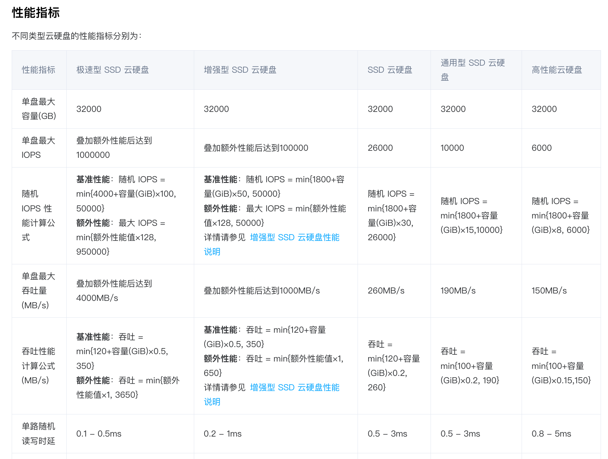

# 背景

目前也算是在分布式存储领域折腾了有一些时间了, 虽然还是比较入门的程度. 

偶然又看到在讨论分布式存储与 集中式存储 应用场景的文档, 回想起来, 做个草草的初步思考.

# 性能评估要注意延时

最早的时候, 我给领导汇报测试数据时, 总是拿着跑`bench`时只管把`depth`往上加的最终数据汇报, 只要能看到IOPS上涨, 就继续加. 当时理解为理解为集群的性能是以depth跑满, 比如把集群的`cpu`或者硬盘的`util`用尽, 出现了硬件或者源码锁的逻辑瓶颈为止, 以该结论来作为集群水平汇报. 看上去数据确实挺美好, 看着至少也有业界的水准了的样子.

但是这里其实当时忽略了延时的因素, 延时应该如何理解呢?

这里的理解方式, 就是`p99`,`p90`等划分一个比例的延时, 要低于指定值, 比如`5ms`内, 这个情况下的IOPS才是一定程度上用户有机会发挥出来的.

为什么我说是有机会呢? 因为这里还存在一个问题, `depth`是否真的用户能跑出来?

诸如数据库或者自己开发的代码, 队列深度以及压力, 一般情况下能达到8/16已经算是比较可以的了.

所以实际上, 比如以`ceph`为例, 假设我现在3节点各3 `ssd`, rbd跑出了`2W IOPS`性能, 还需要细分, 延时是多少, 如果是`3ms`, 则代表我单队列深度时, IOPS只有`333`, 8队列深度时, 此时底层物理盘利用率尚未达到瓶颈, 则可以达到`2664 IOPS`. 

而`2664 IOPS` 一般是无法满足数据库类业务的, 比如说某个现场的一组客户需求, 需要平均`5000 IOPS`,  `boost 15000 IOPS` , 该数据是在`psync 16队列深度下跑出的`, 即基本可以换算为需要`937.5 IOPS`, 即`1.06ms`.  这个量级基本上是SATA固态的裸盘性能了. 

从需求反推, 可以得知这个延时数量级, 只有当我们使用集中式存储的技术(诸如RAID, 且不能是EC类), 或是采用了`nvme`这类物理延时十位数微秒级别的硬件, 分布式存储才有希望可以满足这类用户的需求.

所以, 换句话说. 我们评估一个集群的实际可用性能时, 往往需要考虑用户的实际使用场景, 如果技术上可以做到, 肯定是最好像裸盘的硬件规格一样, 报出的延时和IOPS, 基本上是队列深度`2-8`就能跑出的水平, 从而完全可以保障任意用户都能够取得满足需求的性能. 

以腾讯云的数据为例, 

我的一块100G的云硬盘, 1.3ms, 6000 IOPS

| 队列深度 | IOPS | 延时(ms) | 延时(p999) | 延时(p99) | 延时(p90) |
| -------- | ---- | -------- | ---------- | --------- | --------- |
| 1        | 713  | 1.3      | 146        | 81        | 26        |
| 2        | 1495 | 1.3      | 146        | 75        | 23        |
| 4        | 2828 | 1.4      | 146        | 77        | 25          |
| 8       | 6042 | 1.3      | 130        | 73        | 24        |

[云硬盘 云硬盘类型\-产品简介\-文档中心\-腾讯云](https://cloud.tencent.com/document/product/362/2353)

上面这组数据可以得到的一个推论是, 底层存储能够给予QoS稳定提供`1.3ms`延时, 并且可以支持极大的队列深度.

# 分布式存储的可扩展性体现在哪呢

主要就体现在, 提供了稳定的`1.3ms`延时后, 横向继续加设备,能够不停给这个集群扩充, 让往这个集群申请资源的业务, 能够几近无上限的扩展.

## 要注意多卷并发测试时单卷的性能和延时才是集群稳定的性能和延时

在实际使用`luminous`, 尚未引入`QoS`的版本的`ceph`中会发现, 一个集群只跑单卷时, 16队列比如能提供`4000 IOPS`, 当`2->4->8->16`个卷并发时, 平均单卷的性能降到`3000`, 直到最终可能就`1000`不到. 

TODO: 按照我目前的理解, 这个问题的关键点可能主要是集中在锁抢占或者说op之间排队出队的顺序之类的问题? QoS可能可以缓解这个问题. 亦或是`rocksdb`的一些解决长尾延时问题的技术也有所帮助? 这部分暂未投入了解了. 