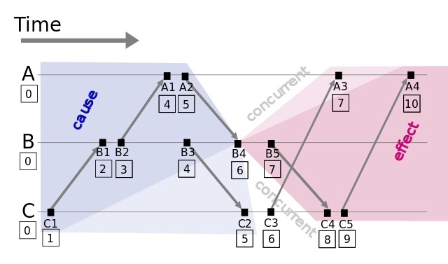

# 背景

在看到这篇论文之前, 我所知道的只是linux上自带的时间戳和`ntp`协议, 以及内核里有一个每次开机启动时开始记录的`monotonic clock`可以用来保障时间一定是连续的.

但是对于分布式设备之间怎么判断互相的时间先后性, 这块是未知的. 

比如针对leader节点发送一次自己的认证失效时间, 假如自己的物理时间戳比那个时间还早, 但真实世界的时间戳已经超期了, 到底是按失效还是有效来进行呢? 不过这个问题似乎可以通过失效后统一发送失效请求, 只要收到了, 或者自身参与选举时的时间加一个超时时间来判断超时来做.

所以, 跟大佬们说的一样, 因此问题的关键点在于节点间的交互要在事件的发生顺序上达成一致，而不是对于时间达成一致。

> 在一个分布式系统中，你无法判断事件A是否发生在事件B之前，除非A和B存在某种依赖关系，即分布式系统中的事件仅仅是部分有序的。

# 逻辑时钟(Time, clocks, and the ordering of events in a distributed system )

基于`Happended Before`偏序关系(因果一致性), 扩展出强一致性的全序关系.

根据[^1]可以得知下述概念.

> 尝试使用逻辑时钟来解决分布式锁问题。
> 
> 分布式锁问题本质上是对于共享资源的抢占问题，我们先对问题进行定义：
> 
> 已经获得资源授权的进程，必须在资源分配给其他进程之前释放掉它；
> 资源请求必须按照请求发生的顺序进行授权；
> 在获得资源授权的所有进程最终释放资源后，所有的资源请求必须都已经被授权了。
> 首先我们假设，对于任意的两个进程Pi和Pj，它们之间传递的消息是按照发送顺序被接收到的, 并且所有的消息最终都会被接收到。每个进程会维护一个它自己的对其他所有进程都不可见的请求队列。我们假设该请求队列初始时刻只有一个消息（T0:P0）资源请求，P0代表初始时刻获得资源授权的那个进程，T0小于任意时钟初始值
> 
> 为请求该项资源，进程Pi发送一个（Tm:Pi）资源请求（请求锁）消息给其他所有进程，并将该消息放入自己的请求队列，在这里Tm代表了消息的时间戳
> 当进程Pj收到（Tm:Pi）资源请求消息后，将它放到自己的请求队列中，并发送一个带时间戳的确认消息给Pi。(注：如果Pj已经发送了一个时间戳大于Tm的消息，那就可以不发送)
> 释放该项资源（释放锁）时，进程Pi从自己的消息队列中删除所有的（Tm:Pi）资源请求，同时给其他所有进程发送一个带有时间戳的Pi资源释放消息
> 当进程Pj收到Pi资源释放消息后，它就从自己的消息队列中删除所有的（Tm:Pi）资源请求
> 当同时满足如下两个条件时，就将资源分配（锁占用）给进程Pi：
> 按照全序关系排序后，（Tm:Pi）资源请求排在它的请求队列的最前面
> i已经从所有其他进程都收到了时间戳>Tm的消息

按照大佬说的, 这个其实算得上是分布式一致性算法的雏形. 每次请求都带上一个逻辑时间戳.

# Reference
1. [分布式系统：Lamport 逻辑时钟 \- 知乎](https://zhuanlan.zhihu.com/p/56146800)

