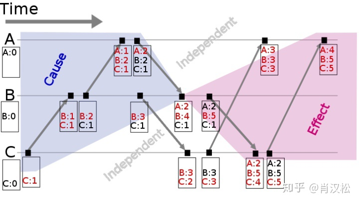

# 向量时钟 vector clock
> 可能有人会有疑问：向量时钟到底有什么用呢？举一个常见的工程应用：数据冲突检测。分布式系统中数据一般存在多个副本，多个副本可能被同时更新，这会引起副本间数据不一致，此时冲突检测就非常重要。基于向量时钟我们可以获得任意两个事件的顺序关系，结果要么是有因果关系（先后顺序），要么是没有因果关系（同时发生）。通过向量时钟，我们能够识别到如果两个数据更新操作是同时发生的关系，那么说明出现了数据冲突。

> 向量时钟算法利用了向量这种数据结构将全局各个进程的逻辑时间戳广播给各个进程：每个进程发送事件时都会将当前进程已知的所有进程时间写入到一个向量中，附带在消息中

## 如何实现向量时钟
> 假设分布式系统中有 N 个进程，每个进程都有一个本地的向量时间戳 Ti，向量时钟算法实现如下：
> 
> 对于进程 i 来说，Ti[i] 是进程 i 本地的逻辑时间
> 当进程 i 当有新的事件发生时，Ti[i] = Ti[i] + 1
> 当进程 i 发送消息时将它的向量时间戳(MT=Ti)附带在消息中。
> 接受消息的进程 j 更新本地的向量时间戳：Tj[k] = max(Tj[k], MT[k]) for k = 1 to N。（MT即消息中附带的向量时间戳）

> 假设有事件 a、b 分别在节点 P、Q 上发生，向量时钟分别为 Ta、Tb，如果 Tb[Q] > Ta[Q] 并且 Tb[P] >= Ta[P]，则a发生于b之前，记作 a -> b，此时说明事件 a、b 有因果关系； 反之，如果 Tb[Q] > Ta[Q] 并且 Tb[P] < Ta[P]，则认为a、b同时发生，记作 a <-> b。例如上图中节点 B 上的第 4 个事件 (A:2，B:4，C:1) 与节点 C 上的第 2 个事件 (B:3，C:2) 没有因果关系，属于同时发生事件。

# 数据冲突检测

根据这个, ceph里的`last_epoch_started`版本号应该也是起这个效果的吧, 具体分析待阅读到那个部分的代码再展开.

# Reference
1. [分布式系统：向量时钟 \- 知乎](https://zhuanlan.zhihu.com/p/56886156)